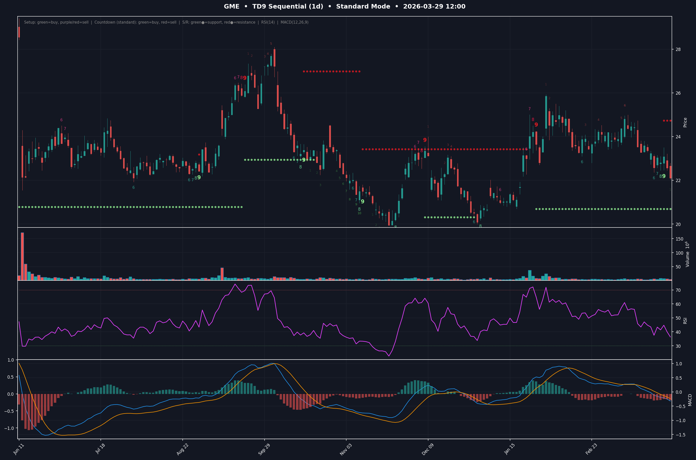
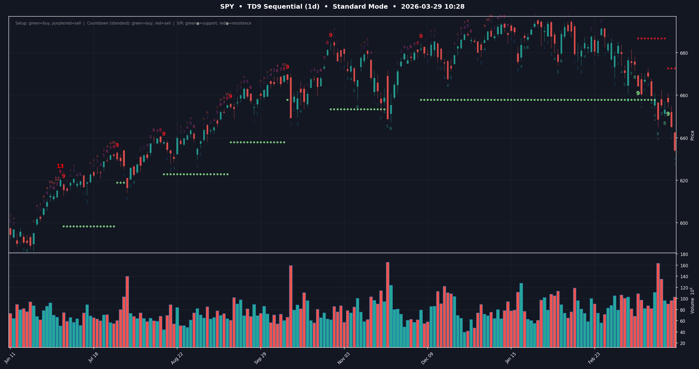

# TD9 Sequential Indicator

A standalone Python implementation of the TD Sequential indicator (Yata/DeMark-style), featuring TD Setup (1–9), TD Countdown (1–13), Support/Resistance levels, and Stealth 9 detection. Outputs an interactive candlestick chart with all signals overlaid.

## Screenshots

**GME — Daily**


**SPY — Daily**


## Installation

```bash
pip install yfinance mplfinance matplotlib pandas numpy
```

## Usage

```bash
python td9.py TICKER [options]
```

### Examples

```bash
# Daily chart, last 200 bars (default)
python td9.py AAPL

# 1-hour chart, 300 bars
python td9.py GME -p 1h -n 300

# Weekly chart
python td9.py SPY -p 1wk

# Aggressive countdown mode
python td9.py NXPI --mode aggressive

# Show all setup counts 1–9 (default shows 6–9)
python td9.py BABA --show 1to9

# Setup only, no countdown overlay
python td9.py GME --no-countdown

# Hide support/resistance lines
python td9.py SPY --no-sr

# Enable stealth 9 detection
python td9.py SPY --stealth

# Text summary only, no chart
python td9.py GME --no-chart

# Print only the current TD number (positive = buy setup, negative = sell setup)
python td9.py GME --td

# Custom output file
python td9.py AAPL -o my_chart.png
```

## Options

| Flag | Default | Description |
|------|---------|-------------|
| `-p`, `--period` | `1d` | Timeframe: `1m`, `2m`, `5m`, `15m`, `30m`, `1h`, `4h`, `8h`, `1d`, `1wk`, `1mo` |
| `-n`, `--bars` | `200` | Number of bars to display |
| `--mode` | `standard` | Countdown mode: `standard` or `aggressive` |
| `--show` | `6to9` | Setup labels to show: `1to9`, `6to9`, `789`, `89`, `only9`, `none` |
| `--no-countdown` | — | Hide countdown (1–13) overlay |
| `--no-sr` | — | Hide support/resistance levels |
| `--stealth` | — | Show stealth 9 signals |
| `--no-chart` | — | Print text summary only, skip chart |
| `--td` | — | Print current TD number and exit (machine-readable) |
| `-o`, `--output` | auto | Output PNG file path |

## Signals

- **Buy Setup (green, below candle):** 9 consecutive closes below the close 4 bars prior
- **Sell Setup (purple→red, above candle):** 9 consecutive closes above the close 4 bars prior
- **Buy Countdown (green, below):** Up to 13 qualifying bars after a completed buy setup
- **Sell Countdown (red, above):** Up to 13 qualifying bars after a completed sell setup
- **Support (green dots):** Lowest low of the 9-bar sell setup window
- **Resistance (red dots):** Highest high of the 9-bar buy setup window
- **Stealth 9 (`s9`):** Opposing setup count of 1 appearing within 1 bar of setup bar 8

## `--td` Output Format

Prints a single integer:
- Positive → current buy setup count (1–9)
- Negative → current sell setup count (−1 to −9)
- `0` → no active setup
